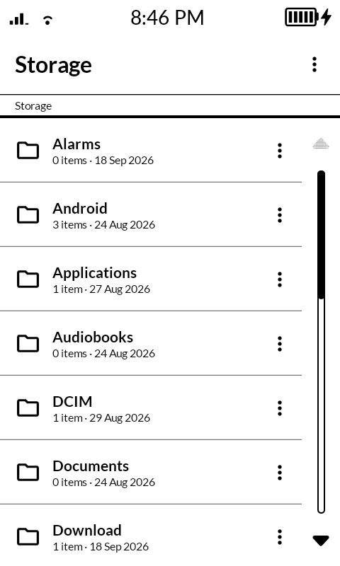
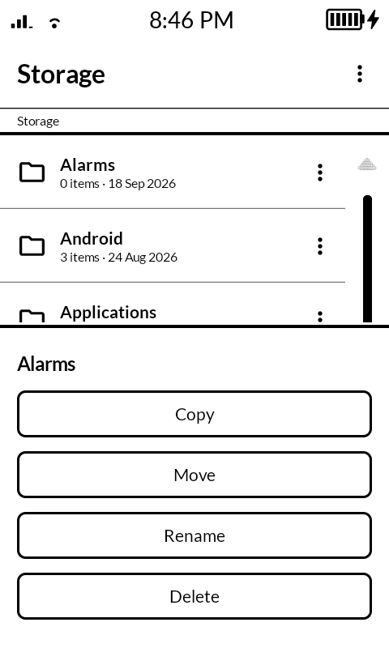
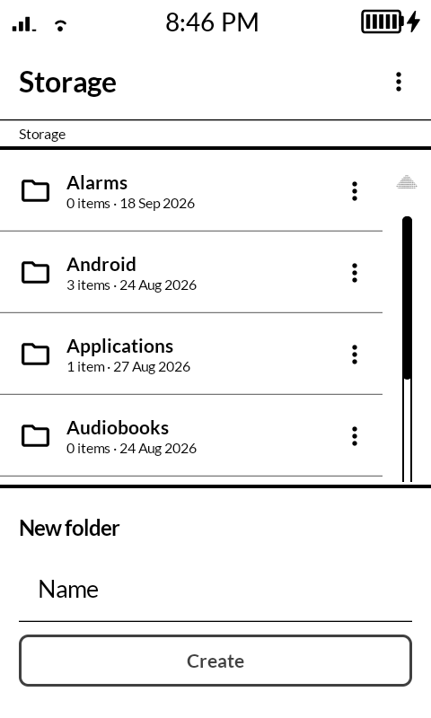

# MonoFiles

A simple file browser for the Mudita Kompakt (e-ink), built with the Mudita Mindful Design (MMD) framework. Browse the device storage, create folders and files, rename, copy, move and delete entries, and open files in the app that handles them. Requires All Files Access, requested on first launch. Fully offline.

<p align="center">
  
  
  
</p>

## Install

```
./gradlew installDebug
```

Or sideload the release APK from `app/build/outputs/apk/release/` (debug-signed on purpose so it installs directly).

## Structure

- `MainActivity.kt`: Entry point; wraps the app in the MMD theme and gates on the All Files Access permission.
- `FilesViewModel.kt`: Current directory state, listing, and file operations (create, rename, delete, copy/move via a clipboard).
- `ui/BrowserScreen.kt`: Directory listing with per-entry actions, bottom sheets for input and confirmation, and file opening via `ACTION_VIEW`.
- `ui/StoragePermissionScreen.kt`: One-time permission onboarding.

## License

[MIT](LICENSE)
